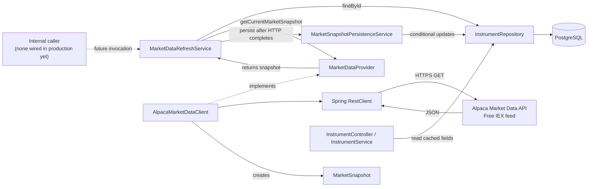

# Market Data Architecture

## 1. Executive summary

We now have the foundations for retrieving a current US-equity market snapshot from Alpaca and caching that snapshot on an instrument in PostgreSQL. A snapshot can contain:

- the current bid and ask with their quote observation time;
- the latest traded price with its separate trade observation time; or
- either complete group when the other group is unavailable.

This solves two related problems. First, we need to distinguish the price a simulated buyer would pay from the price a simulated seller would receive. Second, it needs a last-known price for instrument display and eventual portfolio valuation. These values cannot safely be represented by one generic `price` field.

The implementation is deliberately decoupled from Alpaca in case we want to switch data providers. `MarketDataProvider` exposes a `MarketSnapshot`; `AlpacaMarketDataClient` implements that contract using Alpaca's free IEX stock snapshot endpoint. `MarketDataRefreshService` coordinates one refresh, while `MarketSnapshotPersistenceService` writes complete observations through timestamp-guarded methods already present in `InstrumentRepository`.

Current scope is narrower than a complete trading workflow:

| Implemented now | Not implemented yet |
|---|---|
| Alpaca IEX snapshot request and JSON mapping | Scheduled or automatic refresh |
| Bid, ask, last price, and observation timestamps | A production caller for `refreshInstrument` |
| Validation and typed provider failures | BUY/SELL order acceptance or execution |
| Last-known snapshot persistence | Execution-price freshness rules |
| Read exposure through existing instrument APIs | Market-hours/trading-calendar checks |
| Configurable supported-symbol allowlist | Historical price storage |

No code currently submits a real or paper order to Alpaca. The intended BUY-at-ask and SELL-at-bid behavior remains future simulated-execution work.

## 2. Market data fundamentals

### Bid, ask, and latest traded price

- **Bid price** is the highest currently displayed price at which a buyer is offering to buy.
- **Ask price** is the lowest currently displayed price at which a seller is offering to sell.
- **Latest traded price**, also called `last`, is the price of the most recently reported completed trade. It is historical, even if only milliseconds old, and is not a promise that another trade can execute at that price.

For example, suppose AAPL has this snapshot:

```text
Bid:  $199.90
Ask:  $200.10
Last: $200.00
```

A simulated market BUY uses `$200.10`, because that is the current asking price. A simulated market SELL uses `$199.90`, because that is the current bid. A general instrument display uses `$200.00`, the latest completed trade, as an indicative value.

The intended convention is therefore:

| Use case | Price |
|---|---|
| BUY simulation | Ask |
| SELL simulation | Bid |
| Instrument display or indicative valuation | Latest traded price |

The current code retrieves and stores these values but does not yet apply them to orders. Any future execution remains an internal simulation. It must not be described as an order routed to Alpaca.

## 3. Architecture overview

### Runtime flow




### Component responsibilities

| Component | Responsibility and reason | Dependencies | Called by | Business logic? |
|---|---|---|---|---|
| `MarketSnapshot` | Provider-neutral value containing coherent quote and trade groups | Java `BigDecimal`, `OffsetDateTime` | Provider and refresh/persistence services | Yes: group-coherence invariant |
| `MarketDataProvider` | Stable boundary for retrieving current market data | `InstrumentEntity`, `MarketSnapshot` | `MarketDataRefreshService` | No; it is a contract |
| `AlpacaMarketDataClient` | Alpaca HTTP request, JSON mapping, validation, timestamp normalization, and failure translation | `RestClient`, `AlpacaProperties` | Through `MarketDataProvider` | Yes, at the integration boundary |
| `AlpacaProperties` | Typed binding for credentials, URLs, feed, timeouts, and eligible symbols | Spring configuration binding | Configuration and client | Small amount: symbol normalization |
| `AlpacaMarketDataConfiguration` | Builds a specifically qualified `RestClient` with base URL and timeouts | JDK `HttpClient`, Spring `RestClient` | Spring container | No |
| `MarketDataRefreshService` | Finds an instrument, performs the provider call, and then delegates persistence | Repository, provider, persistence service | No production caller currently | Sequencing only |
| `MarketSnapshotPersistenceService` | Atomically writes the complete groups that are present | `InstrumentRepository`, Spring transactions | Refresh service | Persistence orchestration only |
| `InstrumentRepository` | Reads instruments and performs timestamp-guarded quote/trade updates | MyBatis and PostgreSQL | Refresh/persistence and existing instrument services | Update rules are encoded in SQL |
| `InstrumentService` / `InstrumentController` | Returns last-known cached fields to API consumers | `InstrumentRepository` | HTTP clients using `/instruments` | Mapping/read behavior only |

## 4. Class-by-class implementation walkthrough

### Core market-data types

#### `src/main/java/group12/marketdata/MarketSnapshot.java`

`MarketSnapshot` is a Java record with five fields:

```java
public record MarketSnapshot(
    BigDecimal bidPrice,
    BigDecimal askPrice,
    BigDecimal lastPrice,
    OffsetDateTime quoteAsOf,
    OffsetDateTime lastTradeAsOf
) {}
```

Its compact constructor rejects a partially populated quote or trade group. A quote must contain bid, ask, and `quoteAsOf`; a trade must contain last price and `lastTradeAsOf`. `hasQuote()` and `hasLastTrade()` let persistence decide which complete groups to update.

The record does not know about Alpaca JSON. It also does not enforce positive prices; the Alpaca adapter and database constraints enforce that rule.

#### `src/main/java/group12/marketdata/MarketDataProvider.java`

This interface exposes one method:

```java
MarketSnapshot getCurrentMarketSnapshot(InstrumentEntity instrument);
```

Input is the stored instrument, including its symbol and classification. Output is a provider-neutral snapshot. The interface makes the refresh workflow mockable and prevents future order code from depending directly on Alpaca classes.

### Alpaca adapter and configuration

#### `src/main/java/group12/marketdata/AlpacaMarketDataClient.java`

This is the only `MarketDataProvider` implementation. `getCurrentMarketSnapshot` performs the following work:

1. Normalizes the symbol to uppercase.
2. Requires asset class `Equity`, currency `USD`, and membership in the configured supported-symbol set.
3. Checks that both Alpaca credentials exist and that the feed is `iex`.
4. Sends the snapshot HTTP request with the two Alpaca authentication headers.
5. Maps Alpaca-specific nested records into `BigDecimal` and `OffsetDateTime` values.
6. Validates response symbol consistency, positive prices, timestamps, and coherent groups.
7. Converts observation times to UTC and truncates nanoseconds to PostgreSQL's microsecond precision.
8. Returns a provider-neutral `MarketSnapshot` or throws a typed market-data exception.

Alpaca response records are private nested records, so types such as `AlpacaQuote` cannot leak through the provider interface.

#### `src/main/java/group12/marketdata/AlpacaProperties.java`

This mutable configuration bean uses `@ConfigurationProperties(prefix = "alpaca")`. It binds:

- API key and secret;
- paper-trading URL retained from earlier configuration;
- market-data URL and feed;
- connect and read timeouts; and
- explicitly supported US-equity symbols.

Symbols are trimmed and uppercased when bound. The class has no generated field-based `toString`, which reduces the chance of credentials being accidentally printed.

#### `src/main/java/group12/marketdata/AlpacaMarketDataConfiguration.java`

This configuration enables `AlpacaProperties` and creates the qualified `alpacaMarketDataRestClient` bean. It uses the JDK HTTP implementation through `JdkClientHttpRequestFactory`, applies the configured connect/read timeouts, and sets the market-data base URL. It does not attach credentials globally; the client adds them only to the Alpaca request.

### Refresh and persistence

#### `src/main/java/group12/marketdata/MarketDataRefreshService.java`

`refreshInstrument(Long instrumentId)` is the manual orchestration entry point. It reads the instrument, calls the provider, delegates persistence, and returns the retrieved snapshot.

The method uses:

```java
@Transactional(propagation = Propagation.NOT_SUPPORTED)
```

This suspends any caller transaction while the repository read and network request occur. The persistence call then enters the separate transactional bean. The goal is to avoid holding a database transaction or row lock while waiting on Alpaca.

No controller, scheduler, startup hook, or order service currently calls this method. It is implemented and Spring-managed, but dormant until an internal trigger is added.

#### `src/main/java/group12/marketdata/MarketSnapshotPersistenceService.java`

`persist(Long instrumentId, MarketSnapshot snapshot)` is transactional. It calls `updateQuoteSnapshot` only when the quote group exists and `updateLastTradeSnapshot` only when the trade group exists. Therefore, an absent quote preserves the old quote, and an absent trade preserves the old trade.

Using a separate bean is significant because Spring's proxy-based `@Transactional` behavior is applied when one bean calls another. If both methods were self-invocations in the same class, the transaction annotation on the inner method would not be applied in the usual proxy configuration.

### Exceptions

All market-data exceptions extend `MarketDataException`, an abstract runtime exception.

| Class | Meaning |
|---|---|
| `MarketDataConfigurationException` | Credentials are missing or the configured feed is not IEX |
| `MarketDataAuthenticationException` | Alpaca returned HTTP 401 or 403 |
| `MarketDataRateLimitException` | Alpaca returned HTTP 429 |
| `MarketDataTimeoutException` | A timeout appears in the HTTP exception cause chain |
| `MarketDataProviderException` | Other provider-side HTTP or connectivity failures |
| `MarketDataResponseException` | JSON, symbol, price, timestamp, or group structure is invalid |
| `MarketDataUnavailableException` | Neither a usable quote nor a usable latest trade was returned |
| `UnsupportedInstrumentException` | Instrument is outside the configured USD-equity allowlist |
| `MarketDataInstrumentNotFoundException` | Refresh was requested for an unknown database ID |

There is currently no public refresh endpoint and no `GlobalExceptionHandler` mapping for these exceptions. They propagate to an internal caller as runtime exceptions.

### Existing types extended for market data

#### `src/main/java/group12/Entities/InstrumentEntity.java`

The entity includes `BigDecimal` bid/ask/last values and two `OffsetDateTime` fields. MyBatis maps the corresponding snake-case columns automatically.

#### `src/main/java/group12/dto/InstrumentDTO.java`

The DTO exposes all five market-data fields. This means existing instrument reads can return the last-known cached snapshot without invoking Alpaca.

#### `src/main/java/group12/Repository/InstrumentRepository.java`

`findAll`, `findById`, and `findBySymbol` select the five market-data columns. Two update primitives write independent observation groups:

```sql
AND (quote_as_of IS NULL OR quote_as_of < #{quoteAsOf})
```

and the equivalent condition for `last_trade_as_of`. Equal or older observations update zero rows and are not treated as errors.

#### `src/main/java/group12/Services/InstrumentService.java`

The existing service maps cached fields from `InstrumentEntity` to `InstrumentDTO`. It contains no live fetch or freshness logic.

#### `src/main/resources/application.yml`

The `alpaca` block retains the trading URL and adds data URL, IEX feed, timeouts, and the supported-symbol allowlist. Credentials default to blank so unrelated startup and repository work do not require Alpaca access.

## 5. Database design

The `instruments` table stores one last-known observation per group:

| Column | Type | Meaning |
|---|---|---|
| `bid_price` | `NUMERIC(20,8)` | Bid from the most recently accepted quote |
| `ask_price` | `NUMERIC(20,8)` | Ask from the same quote |
| `last_price` | `NUMERIC(20,8)` | Price from the most recently accepted trade |
| `quote_as_of` | `TIMESTAMPTZ` | Provider observation time for bid and ask |
| `last_trade_as_of` | `TIMESTAMPTZ` | Provider observation time for the latest trade |

Quote and trade timestamps are separate because the latest quote and latest trade are independent events. A quote can change without a trade, and a trade can arrive with a different observation time. One shared timestamp would misrepresent at least one group.

All five fields may initially be `NULL`. This honestly represents an instrument for which Spring has not yet cached market data. The schema does not fabricate zero prices or current timestamps.

PostgreSQL stores last-known values so instrument reads do not need to call Alpaca. This reduces external calls and lets the application display the most recently observed values during ordinary reads. It does **not** make those values current enough for execution.

### Integrity and ordering protections

The schema enforces:

- each present price must be greater than zero;
- bid, ask, and quote timestamp must be all present or all absent; and
- last price and last-trade timestamp must be both present or both absent.

Repository updates include a strict timestamp comparison. A write is accepted only when the stored timestamp is `NULL` or older than the incoming timestamp. This protects the cache if requests finish out of order. Zero affected rows for an equal or older observation are expected.

Prices use decimal storage with 20 total digits and 8 fractional digits. Java uses `BigDecimal` from JSON parsing through repository calls, avoiding binary `double`/`float` rounding. Alpaca timestamps may contain nanoseconds; the client normalizes them to UTC and truncates them to microseconds before persistence so an unrepresentable nanosecond difference cannot cause repeated updates.

### Cached market price versus execution price

`instruments.bid_price`, `ask_price`, and `last_price` are replaceable cache fields. `orders.execution_price` is a permanent fact about a filled simulated order. The current order service does not populate it from market data. Future execution code must select a fresh live bid or ask, validate eligibility, and then store the chosen price on the order; it must not silently treat a cached instrument price as a live execution price.

No historical market-data table exists. Each accepted observation replaces the previous observation for its group.

## 6. Alpaca integration

### Endpoint and feed

The implementation sends:

```http
GET https://data.alpaca.markets/v2/stocks/{symbol}/snapshot?feed=iex
```

The feed is explicitly passed as the `feed` query parameter. Configuration defaults to `iex`, and the client refuses to run if another feed is configured. IEX is Alpaca's free US stock market-data feed used by this project.

The endpoint is for market observations only. It is different from the configured Paper Trading base URL, `https://paper-api.alpaca.markets`, which would be used to simulate brokerage orders on Alpaca. No class in the current code calls the Paper Trading API.

### Environment variables

| Variable | Required to invoke market data? | Default/purpose |
|---|---:|---|
| `ALPACA_API_KEY` | Yes | No default credential |
| `ALPACA_SECRET_KEY` | Yes | No default credential |
| `ALPACA_MARKET_DATA_URL` | No | `https://data.alpaca.markets` |
| `ALPACA_MARKET_DATA_FEED` | No | `iex`; any other value is rejected |
| `ALPACA_CONNECT_TIMEOUT` | No | `2s` |
| `ALPACA_READ_TIMEOUT` | No | `5s` |
| `ALPACA_SUPPORTED_US_EQUITY_SYMBOLS` | Operationally yes | Empty allowlist; expected as a comma-separated list such as `AAPL,MSFT` |
| `ALPACA_TRADE_URL` | No market-data use | Preserved Paper Trading URL, defaulting to `https://paper-api.alpaca.markets` |

Credentials are sent in these headers:

```text
APCA-API-KEY-ID
APCA-API-SECRET-KEY
```

Do not put credentials in source control, documentation examples, URLs, logs, or exception messages.

### Response mapping

| Alpaca JSON | Spring field |
|---|---|
| `symbol` | Response/request consistency check |
| `latestQuote.bp` | `bidPrice` |
| `latestQuote.ap` | `askPrice` |
| `latestQuote.t` | `quoteAsOf` |
| `latestTrade.p` | `lastPrice` |
| `latestTrade.t` | `lastTradeAsOf` |

Unknown JSON fields are ignored. If `latestQuote` is absent, a valid trade can still be returned. If the quote object is supplied but incomplete or invalid, the whole provider response is rejected rather than treating malformed data as absent. The same rule applies to `latestTrade`.

### Supported instruments and limitations

The client requires all of the following:

- `assetClass` equals `Equity`, ignoring case;
- `currency` equals `USD`, ignoring case; and
- the normalized symbol is present in `ALPACA_SUPPORTED_US_EQUITY_SYMBOLS`.

It does not infer US listing from USD currency alone. It does not use the US stock endpoint for FX, crypto, bonds, UK/Indian equities, or unlisted symbols. The current check does not consult an exchange/country field because the schema has none, and it does not require `InstrumentEntity.tradable` to be true. The explicit allowlist is the final eligibility control.

There are no automatic retries, bulk snapshot calls, streaming/WebSocket updates, historical requests, or live-provider tests.

## 7. End-to-end request flow

Assume `AAPL` exists in `instruments`, is classified as a USD equity, and is included in `ALPACA_SUPPORTED_US_EQUITY_SYMBOLS`.

1. **An internal component requests a refresh.** It calls `MarketDataRefreshService.refreshInstrument(instrumentId)`. No production component currently performs this call; this is the implemented entry point awaiting a trigger.
2. **Spring reads the instrument.** `InstrumentRepository.findById` loads AAPL. This is a database read, not a network call. The refresh method runs with transaction propagation `NOT_SUPPORTED`.
3. **Spring calls Alpaca.** The refresh service invokes `MarketDataProvider.getCurrentMarketSnapshot`. The injected `AlpacaMarketDataClient` validates instrument eligibility and configuration, then `RestClient` performs the HTTPS GET. No database write transaction is active around this network wait.
4. **Alpaca returns JSON.** Jackson maps quote and trade prices directly to `BigDecimal` and timestamps to `OffsetDateTime` using private Alpaca response records.
5. **The adapter validates and converts.** The client checks the response symbol, positive prices, required timestamps, and complete groups. Times are normalized to UTC microsecond precision. It creates `MarketSnapshot`.
6. **Spring enters the write transaction.** Only after the HTTP call returns does the refresh service call `MarketSnapshotPersistenceService.persist`. Spring opens a transaction for this separate bean.
7. **Present groups are conditionally updated.** A complete quote calls `updateQuoteSnapshot`; a complete trade calls `updateLastTradeSnapshot`. Both participate in the same transaction. Each SQL update independently rejects equal or older timestamps by affecting zero rows.
8. **The transaction commits.** If both writes succeed, PostgreSQL retains the accepted last-known observations. If the second write fails, the first is rolled back.
9. **The snapshot is returned.** `refreshInstrument` returns the provider snapshot to its internal caller.
10. **Application clients can read cached values.** Existing `GET /instruments`, `GET /instruments/{instrumentId}`, and `GET /instruments/symbol/{symbol}` requests read PostgreSQL through `InstrumentService` and return the fields in `InstrumentDTO`. These reads do not contact Alpaca or check freshness.

## 8. Failure handling

| Situation | Implemented behavior |
|---|---|
| Credentials missing | `MarketDataConfigurationException` is thrown before HTTP; normal application startup is not intentionally blocked |
| HTTP 401/403 | Converted to `MarketDataAuthenticationException` |
| HTTP 429 | Converted to `MarketDataRateLimitException`; there is no retry |
| Timeout | Converted to `MarketDataTimeoutException` when a recognized timeout is found in the cause chain |
| HTTP 5xx | Converted to `MarketDataProviderException` without exposing the response body |
| Other provider connectivity/4xx failure | Converted to a sanitized `MarketDataProviderException` |
| Malformed JSON, symbol mismatch, incomplete supplied group, missing timestamp, or non-positive price | Converted to `MarketDataResponseException` |
| Quote absent but trade valid | Snapshot contains only trade; persistence preserves the stored quote |
| Trade absent but quote valid | Snapshot contains only quote; persistence preserves the stored trade |
| Both groups absent | `MarketDataUnavailableException`; no persistence occurs |
| Equal or older observation | Repository update returns zero rows; this is not exceptional and existing newer data remains |
| PostgreSQL write failure | Transaction rolls back all writes in that `persist` call |
| Provider failure of any kind | Persistence is never called, so cached values remain unchanged |

These exceptions do not reject or fail orders. No market-data code currently changes order status.

During an Alpaca outage, cached values remain useful for display with their original timestamps. They must not silently become execution prices: a stale ask or bid may no longer be available in the market. Future execution logic needs a defined freshness threshold, trading-hours/eligibility rules, and explicit behavior for live-data failure.

## 9. Testing

### Mock HTTP and unit tests

`src/test/java/group12/marketdata/AlpacaMarketDataClientTest.java` uses Spring's `MockRestServiceServer`; it does not contact Alpaca. Its coverage includes:

- exact IEX URL and GET method;
- both authentication headers;
- exact `BigDecimal` mapping;
- quote/trade timestamp parsing and microsecond normalization;
- quote-only and trade-only snapshots;
- completely unavailable data;
- zero and negative prices;
- malformed JSON, missing timestamps, and symbol mismatch;
- HTTP 401, 403, 429, and 5xx;
- simulated socket timeout;
- unsupported symbols and non-USD/non-equity assets; and
- credentials validated at invocation time.

`MarketDataRefreshServiceTest` verifies provider-before-persistence call order, no active transaction during its directly constructed provider invocation, and no persistence after a provider failure.

`MarketSnapshotPersistenceServiceTest` verifies that absent groups are not overwritten and that zero-row repository results are tolerated.

### PostgreSQL integration tests

`FinancialSchemaIntegrationTest` uses a `postgres:18-alpine` Testcontainer. Existing cases cover nullable initial snapshots, coherent persistence, independent group updates, price constraints, group constraints, and older/equal timestamp guards. A market-data-specific test causes the second persistence write to violate a database constraint and then verifies the first write was rolled back.

### Latest local execution result

On September 29, 2026, the focused market-data unit/mock suite reported:

```text
Tests run: 27, failures: 0, errors: 0, skipped: 0
```

The full `mvn test` run reported:

```text
Tests discovered: 114
Passed:           74
Failures/errors:  0
Skipped:          40
```

The 40 skipped cases were Testcontainers tests because Docker was unavailable in that execution environment. Therefore, the current PostgreSQL integration tests—including the new rollback case—compiled but were not runtime-verified in that run. They should be run in CI or locally with Docker before the feature is considered fully integration-verified.

Two additional test gaps are worth noting:

- no test uses real Alpaca credentials or the live network, by design; and
- the unit test constructs `MarketDataRefreshService` directly, so it does not prove that Spring AOP actually suspends an existing outer transaction for `NOT_SUPPORTED`. The annotation is present, but a Spring-context transaction-boundary test would provide stronger evidence.

## 10. Design decisions and trade-offs

| Decision | Rationale | Alternative | Trade-off | Current need or extensibility? |
|---|---|---|---|---|
| `MarketDataProvider` interface | Keeps refresh/order-facing code independent of Alpaca and easy to mock | Inject `AlpacaMarketDataClient` directly | One extra type while only one provider exists | Primarily extensibility and testability |
| Spring `RestClient` | Synchronous flow fits one snapshot request and existing Spring MVC stack | WebClient, raw JDK client, third-party SDK | Blocking call consumes a request thread if later exposed synchronously; avoids adding WebFlux | Necessary implementation choice; appropriately simple |
| Separate data and trading URLs | Alpaca exposes different services and Spring currently calls only market data | One generic Alpaca URL | More configuration, but prevents routing data requests to trading API | Necessary correctness |
| Bid/ask/last stored separately | Supports different BUY, SELL, and display meanings | One generic price | More columns and validation; avoids incorrect price semantics | Necessary |
| Cache on `instruments` | Cheap reads and last-known display without calling Alpaca | Always call provider; separate cache table | Snapshot is replaceable and not historical; simple for current needs | Necessary for current cache requirement |
| Separate quote/trade timestamps | Quote and trade are independent observations | One `price_as_of` | Two update paths and more columns; preserves truth | Necessary |
| Strict timestamp update guards | Prevents slower/older responses overwriting newer data | Lock rows or overwrite unconditionally | Equal timestamps produce zero rows; no exception/reporting | Necessary for concurrent refresh safety |
| Separate retrieval and persistence beans | Keeps network wait outside DB transaction and makes both writes atomic | One service with `TransactionTemplate` after HTTP | Adds a class and proxy boundary | Required behavior; class split is one implementation option |
| Symbol allowlist | Schema cannot prove US listing or exchange | Assume every USD equity is supported; add exchange metadata | Operational configuration must be maintained | Necessary safety workaround |
| No historical market-data table | Requirements need only the latest snapshot | Append every observation to a history table | Cannot reconstruct past valuations; much less storage/complexity | Appropriate current scope |
| No retries | Avoids hidden latency and rate-limit amplification | Bounded retry/backoff | Transient failures surface immediately | Explicit current scope |
| Nullable independent groups | Alpaca may supply quote without trade or vice versa | Require both groups | Consumers must check timestamps/nulls; retains useful partial data | Necessary resilience |

## 11. Simplicity / overengineering review

The overall design is reasonable. The main workflow has only a few steps: call Alpaca, validate the response, and save the newest values. The database rules are also useful because they prevent incomplete or older data from replacing good data.

However, a few parts could be simpler. These are suggestions for team discussion, not changes that must be made now.

### 11.1 There may be too many exception classes

**Current implementation:** There is one base exception and nine specific market-data exceptions.

**Why this may be too complex:** The application does not yet have a production caller or error handler that responds differently to every exception type. This means several small classes currently provide little visible benefit.

**Simpler option:** Keep a few important exceptions, such as configuration, unsupported instrument, and unavailable data. Other provider failures could use one `MarketDataProviderException` with a safe reason such as `AUTH`, `RATE_LIMIT`, `TIMEOUT`, `SERVER`, or `MALFORMED`.

**Risk of simplifying:** Separate exception classes make tests easy to read and allow future callers to handle each problem differently. The current design is valid because the requirements asked for these failures to be distinguished.

### 11.2 `MarketDataProvider` has only one implementation

**Current implementation:** `MarketDataRefreshService` uses the `MarketDataProvider` interface. `AlpacaMarketDataClient` is its only implementation.

**Why this may be too complex:** An interface is not strictly required when there is only one provider.

**Simpler option:** Inject `AlpacaMarketDataClient` directly and introduce an interface only if a second provider is added.

**Risk of simplifying:** The interface is very small, makes testing easier, and keeps future order code independent of Alpaca. Removing it would save little, so keeping it is reasonable.

### 11.3 The feed setting cannot really change

**Current implementation:** `ALPACA_MARKET_DATA_FEED` can be configured, but the client throws an exception unless its value is `iex`.

**Why this may be too complex:** It appears to be a flexible setting, but only one value works.

**Simpler option:** Make `iex` a constant and remove the environment variable until another feed is supported.

**Risk of simplifying:** Changing feeds later would require a code change. The original task also specifically requested a configurable feed, so the current design follows that requirement.

### 11.4 Two services are used to control one transaction boundary

**Current implementation:** `MarketDataRefreshService` performs the network call outside a transaction. It then calls `MarketSnapshotPersistenceService`, which starts the database transaction.

**Why this may be too complex:** `MarketSnapshotPersistenceService` is a small class that mainly exists so Spring can start a transaction at the correct time.

**Simpler option:** Use one service and a Spring `TransactionTemplate`. The service could call Alpaca first and then run both database updates inside the template.

**Risk of simplifying:** `TransactionTemplate` adds transaction-management code directly to the service. The current two-service design makes the boundary easy to see and safely handles a caller that already has a transaction. The extra class is therefore justified, even though another valid design is available.

### 11.5 Validation happens in several places

**Current implementation:** The Alpaca client validates the response, `MarketSnapshot` checks that each group is complete, and PostgreSQL enforces price and group constraints.

**Why this may look too complex:** Similar invalid data can be rejected more than once.

**Simpler option:** Validate only in Java or only in PostgreSQL.

**Risk of simplifying:** Each check protects a different boundary. The client reports bad provider data early, the record protects objects created elsewhere in Java, and the database protects every write path. Keeping these layers is sensible. One small gap remains: `MarketSnapshot` does not check that prices are positive, so future providers must perform that validation themselves.

### 11.6 `AlpacaProperties` includes an unused trading URL

**Current implementation:** `AlpacaProperties` contains both `tradeUrl` and market-data settings, but the market-data code only uses `dataUrl`.

**Why this may be too complex:** One configuration class covers two different Alpaca services even though Paper Trading is not implemented.

**Simpler option:** Split market-data and trading settings when a trading client is added.

**Risk of simplifying now:** `trade-url` already existed, and splitting the configuration today would add more classes without adding useful behavior. Keeping it together is acceptable for now.

### 11.7 Nothing calls the refresh service in production

**Current implementation:** `refreshInstrument` works when called from Java, but no controller, scheduler, startup task, or order service calls it.

**Why this matters:** A deployed application will not automatically request Alpaca data or update the cache. The code is ready for a caller, but the full feature is not operational yet.

**Simpler option:** No existing code needs to be removed. The team should add one controlled internal trigger after deciding when refreshes should happen. A public endpoint should not be added only to make the method reachable.

**Risk of waiting:** Waiting avoids premature scheduling, security, and rate-limit decisions, but cached prices will remain empty or stale until a trigger exists.

### 11.8 Some Spring configuration is not tested through Spring

**Current implementation:** The HTTP tests create the client and properties directly. The transaction-order test also creates `MarketDataRefreshService` directly.

**Why this may be a concern:** These tests do not prove that environment variables bind correctly, timeouts are applied to the real bean, or Spring suspends an existing transaction for `NOT_SUPPORTED`.

**Simpler option:** This does not require changing production code. Add one small Spring configuration test and one transaction-boundary integration test if the team wants stronger verification.

**Risk of adding tests:** Spring context and database tests are slower than unit tests. The current tests already cover the main mapping, validation, and call-order behavior.

In summary, the design is not heavily overengineered. The exception count and fixed-but-configurable feed are the strongest candidates for simplification. The provider interface, validation layers, and separate transaction boundary provide useful protection and are reasonable to keep.

## 12. Current limitations and next steps

### Implemented

- Provider-neutral `MarketSnapshot` and `MarketDataProvider` contract.
- Alpaca single-stock snapshot mapping through Spring `RestClient`.
- Explicit free-IEX query parameter and authentication headers.
- Positive-price, timestamp, response-symbol, and group-coherence checks.
- UTC/microsecond timestamp normalization.
- Explicit USD-equity supported-symbol allowlist.
- Independent, timestamp-guarded quote and trade persistence.
- Atomic persistence transaction after the network request.
- Cached market fields exposed through existing instrument reads.
- Mock/unit coverage for the documented HTTP and validation cases.
- PostgreSQL Testcontainers tests defined for schema/update behavior and rollback.

### Planned or required before simulated execution

- A controlled internal caller for `refreshInstrument`.
- A refresh strategy: on demand, scheduled, batch, or another bounded approach.
- Execution-grade freshness threshold for bid/ask.
- Market-hours and trading-eligibility rules.
- BUY-at-ask and SELL-at-bid integration with the future execution service.
- Clear behavior when live data is unavailable during execution.
- Portfolio valuation using last price with an explicit staleness policy.
- Frontend presentation of price timestamps and stale/unavailable states.

### Unresolved team decisions

1. Which exact US equity symbols belong in the production allowlist, and who maintains it?
2. Should `is_tradable == false` prevent market-data retrieval, or only prevent execution?
3. What component should trigger refreshes, at what cadence, and under what Alpaca rate-limit budget?
4. How fresh must a bid/ask be before simulated execution is allowed?
5. What trading calendar and market-hours source will we use?
6. Should the exception hierarchy remain granular or be consolidated before callers depend on it?
7. Should IEX remain a configurable-but-fixed property or become a constant?
8. Is latest-only storage sufficient for the BRS, or will historical portfolio reconstruction become a requirement?
9. When Docker is available, do all PostgreSQL integration and rollback tests pass in CI?
10. Do live Alpaca credentials authenticate successfully against the configured market-data URL in the deployment environment?

Until these questions are resolved, cached prices should be treated as last-known observations for display—not as guaranteed executable prices.
