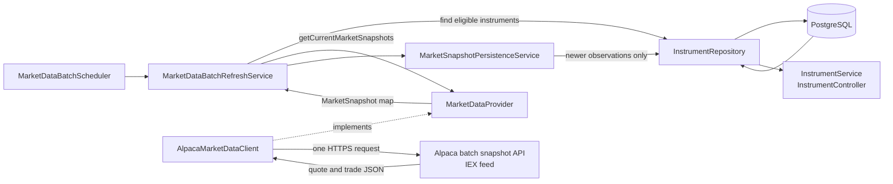

# Market Data Architecture

## 1. Purpose

Alpaca provides external US stock-market data to Spring. Spring retrieves the latest prices and stores them on each instrument in PostgreSQL. The existing instrument API then reads those stored values so the frontend can display them without contacting Alpaca on every request.

Cached prices let every user read the same data from PostgreSQL instead of causing another Alpaca request each time the instrument list is viewed. This prevents display traffic from consuming Alpaca's 200-request-per-minute allowance, while simulated order execution can still make a direct Alpaca call for the freshest available bid or ask.

Spring uses Alpaca Paper Trading account credentials and the IEX market-data feed. The credentials authenticate our market-data requests, but Spring does not send client orders to Alpaca. Order handling remains part of Spring's own simulated trading system.

The code uses Alpaca's market-data URL, not its Paper Trading order URL. No current market-data class submits, changes, or cancels an Alpaca order.

## 2. Prices and timestamps

A market snapshot can contain a quote, a latest trade, or both.

| Value | Plain-language meaning | Stored timestamp |
|---|---|---|
| Bid price | The highest currently displayed price a buyer is offering | `quote_as_of` |
| Ask price | The lowest currently displayed price a seller is asking | `quote_as_of` |
| Last price | The price of the most recently reported completed trade | `last_trade_as_of` |

The bid and ask form one **quote observation**, so they share `quote_as_of`. The last price is a separate **trade observation**, so it has its own `last_trade_as_of`.

For example, a stock could have a bid of `$99.90`, an ask of `$100.10`, and a last trade of `$100.00`. The intended simulated execution rules are:

- BUY uses the latest ask price.
- SELL uses the latest bid price.
- General instrument display can use the last traded price as an indicative value.

These BUY and SELL rules are not connected to the current order workflow yet. The scheduled cache must not be treated automatically as an execution price.

The IEX feed does not represent trading on every US exchange. Its observations can therefore differ from a feed with full US market coverage.

## 3. Configuration

The relevant settings are defined in `src/main/resources/application.yml`.

| Spring property | Environment variable | Default | Purpose |
|---|---|---|---|
| `alpaca.api-key` | `ALPACA_API_KEY` | Empty | Alpaca API key |
| `alpaca.secret-key` | `ALPACA_SECRET_KEY` | Empty | Alpaca secret key |
| `alpaca.data-url` | `ALPACA_MARKET_DATA_URL` | `https://data.alpaca.markets` | Market-data API base URL |
| `alpaca.feed` | `ALPACA_MARKET_DATA_FEED` | `iex` | Market-data feed; the client currently accepts only `iex` |
| `alpaca.connect-timeout` | `ALPACA_CONNECT_TIMEOUT` | `2s` | Maximum time allowed to establish the HTTP connection |
| `alpaca.read-timeout` | `ALPACA_READ_TIMEOUT` | `5s` | Maximum time allowed while waiting for the response |
| `alpaca.supported-us-equity-symbols` | `ALPACA_SUPPORTED_US_EQUITY_SYMBOLS` | Empty | Temporary comma-separated symbol allowlist |
| `market-data.refresh.enabled` | `MARKET_DATA_REFRESH_ENABLED` | `false` | Enables the automatic scheduler |
| `market-data.refresh.interval` | `MARKET_DATA_REFRESH_INTERVAL` | `5s` | Delay between completed refresh cycles |

The scheduler is disabled by default. To enable it, set:

```text
MARKET_DATA_REFRESH_ENABLED=true
```

The interval accepts Spring duration values such as `5s` or `10s`. For example:

```text
MARKET_DATA_REFRESH_INTERVAL=5s
```

The interval is a **fixed delay**. Spring waits until one cycle finishes, then waits for the configured interval before starting the next cycle. A five-second setting therefore means approximately every five seconds plus the time taken by the previous cycle.

Credentials must be supplied through configuration at runtime and must not be committed, logged, or included in error messages.

## 4. Automatic batch refresh

`Application` enables Spring scheduling with `@EnableScheduling`. When `market-data.refresh.enabled` is `true`, Spring creates one centralized `MarketDataBatchScheduler` in that application instance.

Each cycle works as follows:

1. `MarketDataBatchScheduler.runRefreshCycle()` starts after the configured fixed delay.
2. `MarketDataBatchRefreshService.refreshEligibleInstruments()` loads eligible instruments from PostgreSQL.
3. The service groups instruments by normalized symbol and asks the provider for all eligible symbols once.
4. `AlpacaMarketDataClient.getCurrentMarketSnapshots(...)` sends one request to Alpaca's batch snapshot endpoint:

   ```http
   GET /v2/stocks/snapshots?symbols=AAPL,MSFT&feed=iex
   ```

5. Valid snapshots are persisted separately for each matching instrument.

The current batch limit is 50 unique symbols. The configured allowlist and the final batch are both checked against that limit.

Batching reduces API usage. Refreshing 50 symbols separately could require 50 HTTP requests per cycle; the batch endpoint retrieves all 50 in one request.

The scheduler prevents overlapping cycles inside one application process. If Alpaca returns HTTP 429, meaning the request rate was limited, automatic refresh pauses for one minute. Other failures end the current cycle, and the next scheduled cycle can try again. There is no immediate automatic retry.

A five-second refresh does not mean the values will change every five seconds. Alpaca may return the same prices and source timestamps when no newer quote or trade has been published. This is especially common outside regular trading hours.

## 5. Instrument eligibility

An instrument qualifies for automatic refresh only when all of these checks pass:

1. `InstrumentRepository.findTradableUsdEquities()` selects rows whose `is_tradable` value is `TRUE`, asset class is `Equity`, and currency is `USD`.
2. `MarketDataBatchRefreshService` checks those values again and requires a non-null symbol.
3. The normalized uppercase symbol must be present in `ALPACA_SUPPORTED_US_EQUITY_SYMBOLS`.
4. `AlpacaMarketDataClient` performs the same tradable, asset-class, currency, and allowlist checks before making a request.

The symbol allowlist is a temporary safety control. The current database schema does not store enough exchange or country information to prove that every USD equity is supported by Alpaca's US stock endpoint.

If an instrument is changed to non-tradable:

- future scheduler queries no longer select it;
- the Alpaca client rejects it if another caller tries to retrieve it; and
- repository update statements require `is_tradable = TRUE`, protecting against a change made while an Alpaca request is still in progress.

Its last stored prices and timestamps are retained for display. They are not cleared or replaced with zero.

If the allowlist is empty, the refresh service has no eligible symbols and does not call Alpaca.

## 6. Data flow through Spring



The main responsibilities are:

1. **Scheduler:** `MarketDataBatchScheduler` decides when a refresh cycle runs.
2. **Refresh service:** `MarketDataBatchRefreshService` selects eligible instruments, makes one provider call, and coordinates persistence.
3. **Provider boundary:** `MarketDataProvider` defines single-symbol and batch retrieval without exposing Alpaca-specific response classes.
4. **Alpaca client:** `AlpacaMarketDataClient` sends authenticated HTTP requests, maps JSON, validates prices and timestamps, and returns `MarketSnapshot` values.
5. **Persistence service:** `MarketSnapshotPersistenceService.persist(...)` writes each instrument in its own database transaction after the network request has finished.
6. **Repository:** `InstrumentRepository` contains the SQL that accepts only newer quote and trade observations for instruments that are still tradable.
7. **PostgreSQL:** The `instruments` table stores the most recently accepted values.
8. **Instrument API:** `InstrumentService` and `InstrumentController` return the stored values through `GET /instruments`, `GET /instruments/{instrumentId}`, and `GET /instruments/symbol/{symbol}`. These read endpoints do not call Alpaca.

## 7. Mapping and persistence rules

`MarketSnapshot` contains:

```text
bidPrice, askPrice, lastPrice, quoteAsOf, lastTradeAsOf
```

A quote is valid only when bid, ask, and quote timestamp are all present. A trade is valid only when last price and trade timestamp are both present. Alpaca prices must be positive.

A snapshot may contain only a valid quote or only a valid trade. `MarketSnapshotPersistenceService` updates only the observation group that is present:

- a quote-only response updates bid, ask, and `quote_as_of` while keeping the stored trade;
- a trade-only response updates last price and `last_trade_as_of` while keeping the stored quote.

The database columns are:

| Column | Type |
|---|---|
| `bid_price` | `NUMERIC(20,8)` |
| `ask_price` | `NUMERIC(20,8)` |
| `last_price` | `NUMERIC(20,8)` |
| `quote_as_of` | `TIMESTAMPTZ` |
| `last_trade_as_of` | `TIMESTAMPTZ` |

Java uses `BigDecimal` for prices. Provider timestamps are converted to UTC and reduced to PostgreSQL's microsecond precision before persistence.

Quote and trade updates have independent timestamp guards:

```sql
quote_as_of IS NULL OR quote_as_of < incoming_quote_as_of
```

```sql
last_trade_as_of IS NULL OR last_trade_as_of < incoming_last_trade_as_of
```

Only a strictly newer observation replaces the stored group. An equal or older timestamp updates zero rows and leaves the newer cached value unchanged. This protects against duplicate observations and requests that finish out of order.

## 8. On-demand data for simulated order execution

Scheduled refresh and on-demand retrieval serve different purposes:

| Scheduled batch refresh | On-demand single refresh |
|---|---|
| Keeps display data reasonably current | Intended to retrieve data when an order is being executed |
| Uses one batch request for all eligible symbols | Uses one request for one instrument |
| Runs only when the scheduler is enabled | Runs only when an internal caller invokes it |
| Must not silently provide an execution price | Intended rule is BUY at ask and SELL at bid |

`MarketDataRefreshService.refreshInstrument(Long instrumentId)` implements the single-instrument retrieval and persistence path. It calls `MarketDataProvider.getCurrentMarketSnapshot(...)`, which `AlpacaMarketDataClient` implements with:

```http
GET /v2/stocks/{symbol}/snapshot?feed=iex
```

This method is Spring-managed, but no production order service, controller, or scheduler currently calls it. BUY-at-ask and SELL-at-bid are therefore intended behavior, not completed order-execution behavior.

Before connecting it to order execution, the team still needs rules for price freshness, market hours, and what happens when live market data is unavailable. Cached scheduled values should not be used as a silent fallback because they may be stale.

## 9. Failure behavior

| Situation | Current behavior |
|---|---|
| Credentials are missing | The request fails with a configuration exception before HTTP is sent |
| Instrument is unsupported or non-tradable | The client rejects it before HTTP is sent |
| Alpaca returns 401 or 403 | Authentication exception |
| Alpaca returns 429 | Rate-limit exception; the scheduler starts a one-minute cooldown |
| Connection or response times out | Timeout exception |
| Alpaca returns a server or other HTTP error | Provider exception |
| JSON, prices, or timestamps are invalid | Response exception |
| Batch response omits a requested symbol | That instrument keeps its stored values |
| One batch entry is unusable | That symbol is skipped; other valid entries can still be persisted |
| Provider call fails before persistence | All existing cached values remain unchanged |
| One instrument fails during batch persistence | The failure is logged and other returned instruments continue |

These failures do not submit orders or change order status. There is no public market-data refresh endpoint.

## 10. Main classes

| Class | Role |
|---|---|
| `AlpacaProperties` | Binds Alpaca credentials, URL, feed, timeouts, and the symbol allowlist |
| `AlpacaMarketDataConfiguration` | Builds the dedicated Spring `RestClient` with connect and read timeouts |
| `MarketDataProvider` | Provider-neutral contract for single and batch snapshots |
| `AlpacaMarketDataClient` | Alpaca HTTP integration and response mapping |
| `MarketSnapshot` | Provider-neutral quote and trade value object |
| `MarketDataBatchScheduler` | Starts enabled fixed-delay refresh cycles and handles cooldown |
| `MarketDataBatchRefreshService` | Selects eligible instruments and coordinates one batch refresh |
| `MarketDataRefreshService` | Provides the currently unused single-instrument refresh path |
| `MarketSnapshotPersistenceService` | Writes complete quote/trade groups in a transaction |
| `InstrumentRepository` | Selects instruments and performs guarded SQL updates |
| `InstrumentService` / `InstrumentController` | Exposes the stored market data through existing instrument endpoints |

## 11. Why the implementation is split this way

The implementation uses a few small classes, but each one has a clear job:

- `MarketDataProvider` keeps the rest of the application independent of Alpaca and makes tests easier, even though Alpaca is currently the only provider.
- Retrieval and persistence are separate so Spring does not keep a database write transaction open while waiting for the network.
- Quote and trade writes are separate because they can arrive independently and have different timestamps.
- Specific exception types let the scheduler distinguish rate limiting from other failures without inspecting error-message text.

Two limitations are important:

- The feed is configurable, but the client currently accepts only `iex`.
- The overlap check and cooldown are held in memory. If several application instances enable the scheduler, each instance runs its own refresh cycle. Until distributed coordination is added, automatic refresh should be enabled on only one deployed instance.

## 12. Testing and current scope

Unit and mock-HTTP tests cover the Alpaca mapping, batch request, scheduler, eligibility rules, partial snapshots, persistence behavior, timestamps, and error handling. PostgreSQL Testcontainers tests cover the real schema and guarded updates when Docker is available.

The live tests are opt-in. A normal `mvn test` run must not contact Alpaca. Live tests run only when `ALPACA_LIVE_TEST=true` and credentials are supplied through `ALPACA_API_KEY` and `ALPACA_SECRET_KEY`.

Implemented now:

- opt-in scheduled batch retrieval for up to 50 unique symbols;
- IEX quote and latest-trade mapping;
- independent, newer-only quote and trade persistence;
- non-tradable write protection;
- last-known market values returned by the existing instrument API; and
- a single-instrument refresh method available for a future internal caller.

Not implemented now:

- submitting Spring client orders to Alpaca;
- connecting live bid/ask retrieval to order execution;
- execution-price freshness or market-hours rules;
- distributed scheduling across multiple application instances;
- streaming market data; or
- historical market-price storage.
