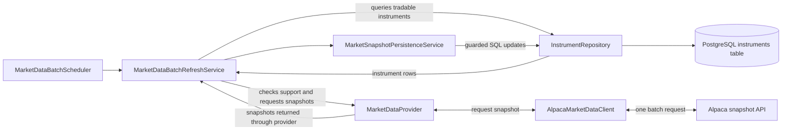

# Market Data Refresh

## Purpose

The market-data refresh keeps the latest accepted quote and trade for each supported, tradable instrument in PostgreSQL. This gives the rest of the application one stored source of market data without making an Alpaca request whenever a price is needed.

## Refresh flow

`MarketDataProvider` is the provider-neutral boundary. In the current application, `AlpacaMarketDataClient` implements that boundary.

## One refresh cycle

1. `MarketDataBatchScheduler` starts a cycle on the configured fixed delay when `market-data.refresh.enabled` is `true`. It calls `MarketDataBatchRefreshService`.
2. `MarketDataBatchRefreshService` asks `InstrumentRepository` for rows marked tradable. It then asks the active `MarketDataProvider` whether each instrument is supported. The current Alpaca provider accepts nonblank, allowlisted symbols whose asset class is `Equity` and currency is `USD`. Supported instruments are grouped by normalized symbol.
3. Through the `MarketDataProvider` interface, the refresh service asks `AlpacaMarketDataClient` for the current snapshots. The client checks support again and makes one Alpaca batch snapshot request for the supported symbols.
4. The client maps Alpaca's returned quotes and trades to provider-neutral `MarketSnapshot` values. The refresh service matches each snapshot back to its instrument rows and passes it to `MarketSnapshotPersistenceService`.
5. `MarketSnapshotPersistenceService` coordinates the writes, while `InstrumentRepository` performs the actual SQL updates on the PostgreSQL `instruments` table.

## What gets persisted

Each `instruments` row can store the latest accepted:

- bid price and ask price, together with their quote timestamp;
- last price, together with its last trade timestamp.

Quotes and trades are updated independently because either one may be present without the other. Each repository update requires a timestamp strictly newer than the value already stored, so an older or duplicate observation cannot overwrite newer market data. The SQL also rechecks that the instrument is still tradable before writing.

## Order execution boundary

Order validation and execution must never call Alpaca directly. Order execution does not currently call Alpaca; when market-data-based execution is added, it will read the persisted values from the PostgreSQL `instruments` table.
